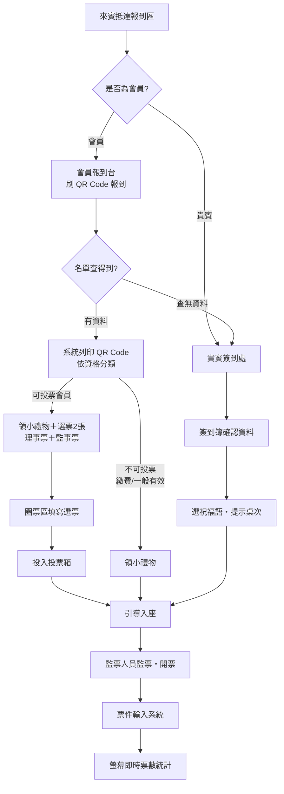

# TADA 第六屆會員大會 — 報到・領票・投票・開票流程 v1

> 適用場合：2026/9/4 第六屆會員大會暨理監事選舉（臻愛婚宴會館）
> 涵蓋範圍：來賓分流 → 會員報到 → 貴賓簽到 → 領禮領票 → 圈票投票 → 入座 → 監票開票 → 即時秀票

---

## 一、報到身分分類（入口分流）

來賓抵達報到區，先分兩種身分：

| 身分 | 判定 | 動線 |
|---|---|---|
| **會員** | 在會員名單內 | 會員報到台（刷 QR Code） |
| **貴賓** | 不在會員名單內 | 貴賓簽到處（簽到簿） |

---

## 二、會員報到（會員報到台）

1. 會員出示 **QR Code 刷碼報到**。
2. **查無資料**：掃描後在會員名單中找不到 → 引導至**貴賓簽到處**改走貴賓流程。
3. 查有資料：系統**列印 QR Code**，並依資格自動分類：

| 資格 | 領取項目 | 後續 |
|---|---|---|
| **(a) 可投票會員（有效會員）** | 小禮物＋**選票 2 張（理事票＋監事票）** | 前往圈票區 |
| **(b) 繳費會員／一般有效會員（不可投票）** | 小禮物 | 直接引導入座 |

---

## 三、貴賓簽到（貴賓簽到處）

1. 引導至貴賓簽到處，在**簽到簿**確認貴賓資料，完成報到。
2. 系統可選擇**祝福語**。
3. 系統**提示桌次**，工作人員引導就座。

---

## 四、投票與入座（圈票區・投票箱）

1. 有領票的會員引導至旁邊**圈票區**填寫選票（理事票、監事票各 1 張）。
2. 填寫完成後，將選票**投入投票箱**。
3. 投完票後，由工作人員**引導入座**。

---

## 五、監票與開票（監票區・統計畫面）

1. 全員入座後，由**監票人員**進行監票與開票。
2. 開出的票件**輸入系統**。
3. 得票數**即時顯示於螢幕的票數統計畫面**（開票直播頁）。

---

## 流程圖

---

## 現場分工對照（建議）

| 站點 | 工作 | 使用工具 |
|---|---|---|
| 會員報到台 | 刷碼報到、列印 QR、發禮物與選票 | 報到機（/checkin、/kiosk）、印表機 |
| 貴賓簽到處 | 簽到簿確認、祝福語、桌次提示 | 貴賓簽到（/guest、/blessing、祝福牆 /wall） |
| 圈票區 | 指引填票、維持秩序 | 紙本選票 |
| 投票箱 | 看守票箱 | — |
| 監票／開票區 | 監票、唱票、輸入系統 | 開票輸入（VLM 判讀輔助）、開票直播（/election-live） |

> 相關文件：`報到機開發交接.md`、`報到機擴充_身分選單與貴賓報到.md`、`紙本選票設計_VLM判讀.md`、`開票判定改善規格.md`
